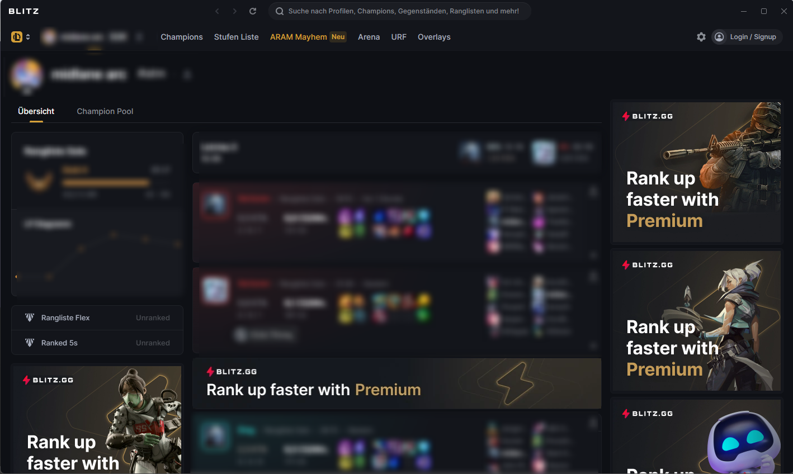
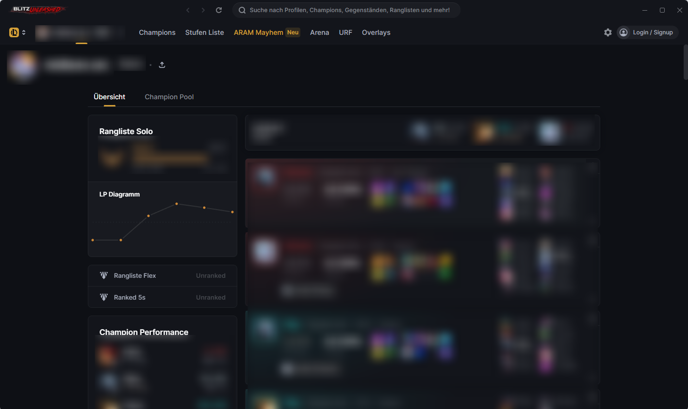
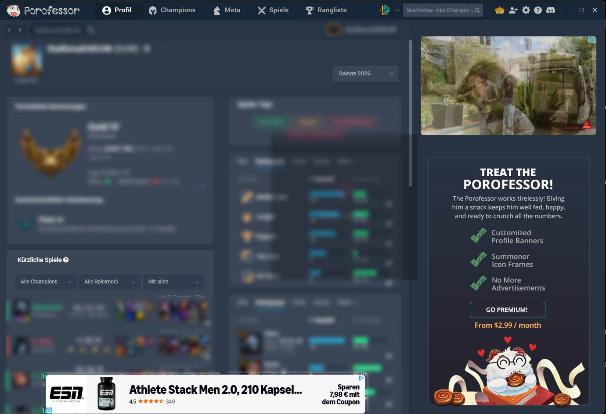
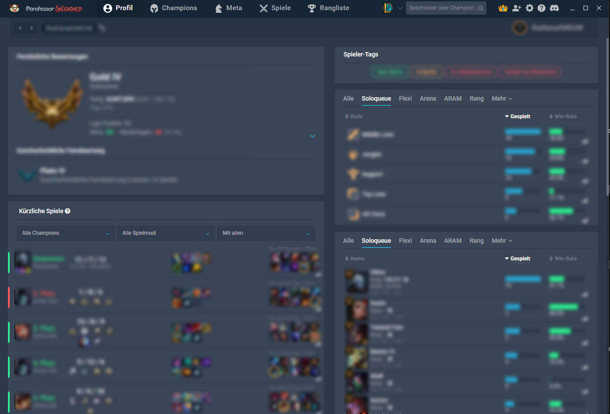

# Unleashed

An ad-free companion layer for the **Blitz** and **Porofessor** desktop apps (League of Legends).
It removes the in-app advertising and reclaims the wasted layout space, without ever touching the
apps themselves.

## What it is

Unleashed is **not** a mod, a crack, or a patched build. It never edits, replaces, or injects into
Blitz's or Porofessor's files. Their code stays 100% untouched. Instead it runs a small
**companion daemon** alongside the app:

- It starts the app together with a lightweight background process (a PowerShell daemon, no Node
  and no extra runtime; everything it needs ships with Windows).
- The daemon attaches to the **already-running** app through the app's own developer interface (the
  Chrome DevTools Protocol that every Electron app exposes) and, at display time, blocks the ad
  network requests and hides the ad slots, then restores the full-width layout.
- It runs **only while the app runs**. Close Blitz or Porofessor and the daemon exits on its own
  (process-dependent). Nothing stays resident, and nothing runs in the background for no reason.
- Because it only changes what is *shown* in the live window, never any file on disk, the app
  keeps updating normally and there is nothing to "re-patch".

After a reboot, a crash, or an app update it simply re-attaches the next time the app starts.

## Before / after

### Blitz
| With ads (stock) | Ad-free (Unleashed) |
| :--: | :--: |
|  |  |

### Porofessor
| With ads (stock) | Ad-free (Unleashed) |
| :--: | :--: |
|  |  |

## Download & install

1. Download **UnleashedBypass.cmd** from the [latest release](../../releases/latest).
2. Run it and pick an install option (auto-install detects both apps).
3. Done. Start Blitz / Porofessor as usual and the ads are gone.

The installer pulls its components from this repo, verifies each one by SHA256, and keeps itself
and the daemons up to date. An optional auto-updater keeps everything current in the background,
and the installer tells you when a newer version of itself is available and updates on
confirmation.

## Repository layout (for maintainers)

- `UnleashedBypass.cmd`: the installer / CLI (source). Published to the rolling release.
- `src/`: daemon sources (edit these).
- `dist/`: generated channel, `manifest.json` + daemons (served via raw, SHA256-pinned).
- `assets/`: README images.
- `scripts/build-manifest.ps1`: builds `dist/`.
- `.github/workflows/release.yml`: on push to `main`, rebuilds `dist/` (bumping only the files
  that changed) and refreshes the installer release.

### Releasing

Edit a daemon in `src/` (or the installer, bumping `$VERSION` in the `.cmd` for installer changes)
and push to `main`. The workflow rebuilds the manifest and updates the release; clients pick up the
changes automatically.
